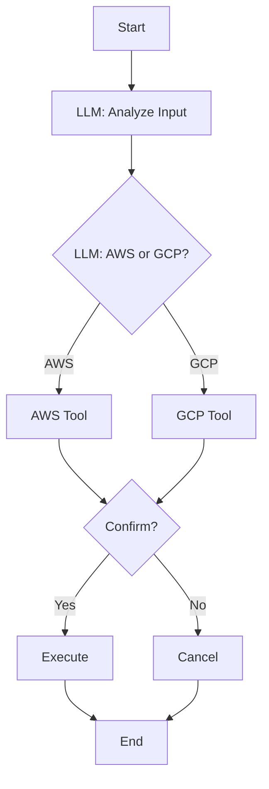

# Cloud Bucket Creator

This directory contains a more structured implementation of Factor 1, demonstrating natural language enhanced commands with specific tools for creating cloud storage buckets.

## Overview

The `cloud_bucket_creator.py` script implements a constrained approach where the LLM is limited to using specific tools for creating storage buckets in different cloud providers (AWS S3 or Google Cloud Storage) based on natural language requests.

## Features

- Create AWS S3 buckets with natural language commands
- Create Google Cloud Storage buckets with natural language commands
- Configurable defaults via PROJECT.md
- Color-coded terminal interface (color-blind friendly)
- Confirms command execution before running
- Structured tool definitions with parameter validation

## How It Works

1. The user provides a natural language request to create a cloud storage bucket
2. The system loads configuration defaults from PROJECT.md
3. The LLM (Claude) processes the request and selects the appropriate tool
4. The generated command is shown to the user for confirmation
5. If confirmed, the command is executed and the output is displayed



## Requirements

In addition to the [common requirements](../README.md#requirements), you'll need:
- AWS CLI (for AWS S3 buckets)
- Google Cloud SDK (for GCP buckets)

## Installation

1. Follow the installation steps in the [parent directory README](../README.md#getting-started)
2. Make sure you have the appropriate cloud CLI tools configured:
   - For AWS: `aws configure`
   - For GCP: `gcloud auth login`

## Usage

Run the script:
```bash
python cloud_bucket_creator.py
```

Then enter your request in natural language:
```
Create a bucket named logs-archive in us-west-2
```

The script will:
1. Parse your request using Claude
2. Show you the exact command that will be executed
3. Ask for confirmation before running
4. Execute the command and show the result

## Configuration

The application uses `PROJECT.md` to store configuration defaults. This file is read every time the script runs, so you can modify it to change the defaults without editing code.

Example configuration:
```markdown
# Cloud Bucket Configuration

## Cloud Provider Settings

### Default Provider
- provider: AWS

## Bucket Settings

### Global Settings
- prefix: app-vitals-

### AWS S3 Settings
- region: us-west-2

### Google Cloud Storage Settings
- region: us-east2
```

## Example Requests

- "Create an S3 bucket named user-uploads"
- "Make a GCS bucket called analytics-data in us-central1"
- "Create a bucket for storing log files in the asia region"

## Security Improvements

Compared to the no-tools approach, this implementation:
- Constrains the LLM to use only specific tools with defined parameters
- Adds validation for tool inputs
- Provides explicit configuration for defaults
- Shows commands before execution
- Limits actions to specific cloud operations