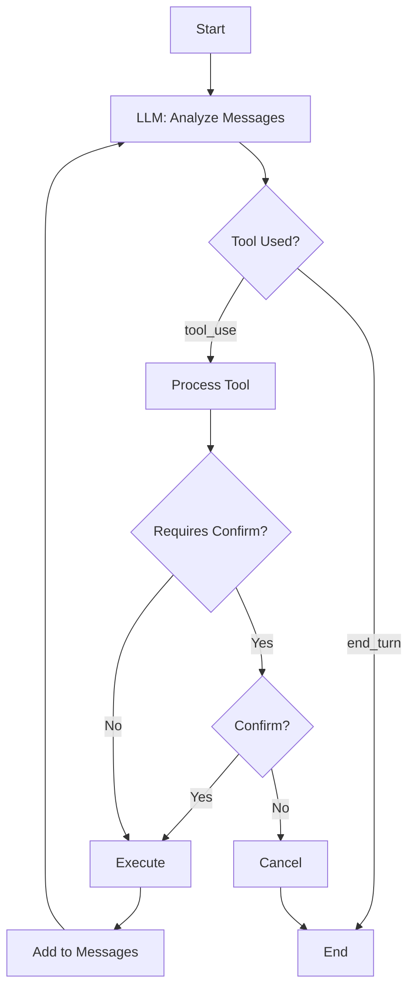

# AWS Tools Workflow

This directory contains an advanced implementation of Factor 1, demonstrating structured tool calls with validation in a multi-step workflow.

## Overview

The `aws_tools.py` script implements a conversation-based workflow with multiple validation checks for creating AWS S3 buckets. It shows how LLMs can be constrained to follow a process with validation at each step.

## Features

- Multi-step workflow for AWS S3 bucket creation
- Region validation before attempting bucket creation
- Existence checking to prevent duplicate buckets
- Direct SDK integration instead of shell commands
- Structured tool definitions with clear parameter validation
- Conversation-based interaction for complex workflows

## How It Works

1. The user provides a natural language request to create a cloud storage bucket
2. The LLM (Claude) processes the request and follows a structured workflow:
   - Validates that the requested region is valid
   - Checks if the bucket already exists
   - Creates the bucket only after validation passes
3. Each tool call requires explicit confirmation for actions that make changes
4. The system maintains conversation context for multi-turn interactions



## Architecture Improvements

- Uses boto3 SDK directly instead of shell commands
- Implements detailed error handling and validation
- Supports conversation-based workflows
- Pre-validates parameters before attempting operations
- Maintains state across multiple interactions

## Requirements

In addition to the [common requirements](../README.md#requirements), you'll need:
- AWS credentials configured for boto3

## Installation

1. Follow the installation steps in the [parent directory README](../README.md#getting-started)
2. Configure AWS credentials:
   ```bash
   aws configure
   ```

## Usage

Run the script:
```bash
python aws_tools.py
```

Then enter your request in natural language:
```
Create a bucket named logs-archive in us-west-2
```

The script will:
1. Parse your request using Claude
2. Validate the region is valid for AWS
3. Check if the bucket already exists
4. Request confirmation before creating the bucket
5. Create the bucket and show the result

## Security Improvements

Compared to previous implementations, this approach:
- Validates inputs before attempting operations
- Uses the AWS SDK directly instead of shell commands
- Implements proper error handling and reporting
- Only asks for confirmation on write operations
- Maintains context through a stateful conversation

## Example Requests

- "Create an S3 bucket named user-uploads"
- "I need a new bucket called analytics-data in us-east-1"
- "Create a bucket for storing log files in us-west-2"